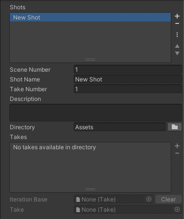

# Shot Library

[!INCLUDE [banner-message](banner-message.md)]

A Shot Library is an asset that stores shot definitions.

Use Shot Libraries to preconfigure sets of shots to use with the [Shot Player](ref-component-shot-player.md). This enables the automatic use of preconfigured properties when recording new takes.

* To create a new Shot Library, from the Unity Editor menu, select **Assets > Create > Live Capture > Shot Library**.
* To create a [Shot Player](ref-component-shot-player.md) and preview takes from a Shot Library, drag and drop the Shot Library asset to the Scene Hierarchy.

## Shots

The list of shots stored in the Shot Library.

* Use the list management buttons at the right to add, remove, search, and reorder shots in the list.
* Select a shot in the list to display its properties below.

## Shot Properties

All properties of the shot currently selected in the **Shots** list.

| Property | Description |
|:---|:---|
| **Scene Number** | The number of the cinematic scene for which you record the shots. |
| **Shot Name** | The name of the shot. |
| **Take Number** | The take index of the shot. |
| **Description** | The description of the shot. |
| **Directory** | The project folder to save the recorded takes to. To change the path, type in the field or use the folder button at the right. |
| **Takes** | The list of recorded takes currently available in the directory. |
| **Iteration Base** | The take to play and iterate on in a recording session. |
| **Take** | The current take selected in the **Takes** list. |
