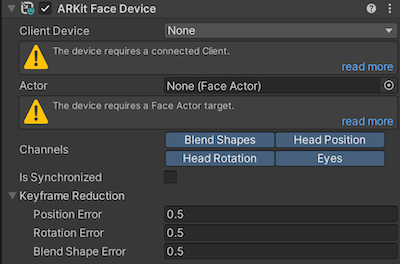

# ARKit Face Device component

[!INCLUDE [banner-message](banner-message.md)]

The ARKit Face Device is a Live Capture Device that records and applies, in real time, face properties from a connected Client Device to an [ARKit Face Actor](ref-component-arkit-face-actor.md).

The ARKit Face Device communicates with a specific connected Client Device (Companion App installed on a physical mobile device) in order to retrieve the face properties.

## Bindings

| Property | Function |
|:---|:---|
| **Client Device** | The connected Client Device to use. The selection list reflects the list of Clients that are currently connected to the Server in the [Connections window](ref-window-connections.md). |
| **Actor** | The target ARKit Face Actor to animate. |

## Channels

This section allows you to control which channels to activate or deactivate for recording when the Take Recorder is in Live mode.

Each channel represents a face property that you might want to animate separately from the others during the recording of a take:
* **Blend Shapes**
* **Head Position**
* **Head Rotation**
* **Eyes**

## Keyframe Reduction

Allows you to adjust the level of keyframe reduction applied to your recordings. Higher values produce smaller files but might affect the recorded animation curve accuracy. 

| Property | Function |
|:---|:---|
| **Position Error** | The relative tolerance (in percent) for reducing position keyframes. |
| **Rotation Error** | The tolerance (in degrees) for reducing rotation keyframes. |
| **Blend Shape Error** | The relative tolerance (in percent) for reducing blend shape keyframes. |
